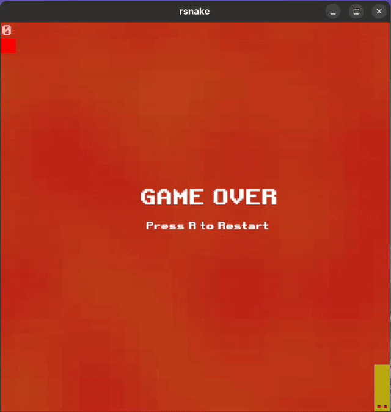

# 🐍 rsnake

A classic Snake game implementation in Rust, featuring smooth multithreaded gameplay, particle effects, and groovy background music.



## ✨ Features

- **Multithreaded Game Loop** - Game logic runs on a separate thread for lag-free, consistent gameplay
- **Particle Effects** - Colorful particle bursts when eating fruit
- **Perlin Noise Background** - Procedurally generated terrain-like grid background
- **Dynamic Snake Colors** - Snake changes color each time it eats
- **Snake Jazz™** - Looping background music with sound effects
- **Retro Pixel Font** - Classic arcade-style score display

## 🎮 Controls

| Key | Action |
|-----|--------|
| **W** / **↑** | Move Up |
| **A** / **←** | Move Left |
| **S** / **↓** | Move Down |
| **D** / **→** | Move Right |
| **R** | Restart (after game over) |
| **M** | Toggle music mute |

## 🚀 Getting Started

### Prerequisites

- [Rust](https://www.rust-lang.org/tools/install) (2018 edition or later)
- A working audio output device (for Snake Jazz 🎷)

### Installation

```bash
# Clone the repository
git clone https://github.com/yourusername/rsnake.git
cd rsnake

# Run in development mode
cargo run

# Or build an optimized release binary
cargo build --release
./target/release/rsnake
```

### Linux Dependencies

On some Linux distributions, you may need to install additional libraries for graphics and audio:

```bash
# Debian/Ubuntu
sudo apt-get install libasound2-dev libxcursor-dev libxi-dev libxrandr-dev libgl1-mesa-dev

# Arch Linux / EndeavourOS
sudo pacman -S alsa-lib libxcursor libxi libxrandr mesa
```

## 🏗️ Architecture

The project is organized into several modules:

| Module | Description |
|--------|-------------|
| `main.rs` | Window setup, event handling, audio management, and render loop |
| `game.rs` | Core game state, multithreaded update loop, and collision detection |
| `snake.rs` | Snake entity with movement, growth, and self-collision logic |
| `draw.rs` | Rendering utilities, Perlin noise background, and block drawing |
| `particles.rs` | Particle system for fruit collection effects |
| `physics.rs` | Position and Direction types for game entities |
| `colors.rs` | Color constants for all game elements |

### Multithreading Approach

One of the main learning goals of this project was understanding concurrent programming in Rust. The game uses:

- **Arc<Mutex<GameState>>** - Thread-safe shared state between the render thread and game logic thread
- **Dedicated game thread** - Runs at a fixed 10 FPS tick rate, independent of render frame rate
- **Lock-free input handling** - Direction changes are queued and applied on the next game tick

This architecture ensures smooth rendering even when game logic is processing, eliminating the input lag that plagued earlier sequential implementations.

## 🎨 Customization

### Colors

Edit `src/colors.rs` to customize the game's color palette:

```rust
pub const SNAKE: Color = [0.1, 0.9, 0.1, 1.0];  // RGB + Alpha
pub const FRUIT: Color = [1.0, 0.0, 0.0, 1.0];
pub const GRID_LIGHT: Color = [0.2, 0.35, 0.15, 1.0];
pub const GRID_DARK: Color = [0.25, 0.2, 0.15, 1.0];
```

### Game Settings

Adjust difficulty in `src/game.rs`:

```rust
const FPS: f64 = 10.0;  // Game speed (higher = faster snake)
```

And in `src/main.rs`:

```rust
const WIDTH: u32 = 25;   // Grid width in blocks
const HEIGHT: u32 = 25;  // Grid height in blocks
```

## 📦 Dependencies

| Crate | Purpose |
|-------|---------|
| [piston_window](https://github.com/PistonDevelopers/piston_window) | 2D graphics and window management |
| [rodio](https://github.com/RustAudio/rodio) | Audio playback for music and sound effects |
| [noise](https://github.com/Razaekel/noise-rs) | Perlin noise generation for backgrounds |
| [rand](https://github.com/rust-random/rand) | Random number generation |
| [find_folder](https://github.com/PistonDevelopers/find_folder) | Asset folder discovery |

## 🎵 Assets

- `retro-gaming.ttf` - Pixel font for score display
- `snakejazz.ogg` - Background music loop
- `appleobtained.ogg` - Sound effect when eating fruit

## 📝 License

This project is licensed under the MIT License - see the [LICENSE](LICENSE) file for details.

## 🙏 Acknowledgments

- Inspired by the classic Nokia Snake game
- Snake Jazz audio inspired by a certain interdimensional TV show
- Built as a learning project for Rust concurrency patterns

---

*Made with 🦀 and a lot of Snake Jazz*